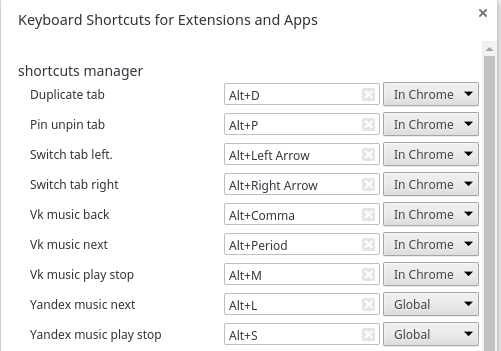

# chrome-shortcut-manager

Application allows to override base chrome shortcuts

Shortcuts:
1. Yandex music control
2. VK music control
3. Pin tab
4. Switch tab
5. Duplicate tab


## Getting Started

These instructions will get you a copy of the project up and running on your browser.

### Prerequisites
```
Chrome or Chromium web browser 
```

### Installing
1. Download or clone repository
2. Go to [chrome extension](chrome://extensions/) chrome://extensions/
3. Enable developer mode
4. Load extension via "Load unpacked extension…" button
5. Go to [Chrome extension shortcuts](chrome://extensions/configureCommands) chrome://extensions/configureCommands
5. Set your shortcuts



## Authors

* **Siarhei Blashuk** - *Developer* - [GitHub](https://github.com/BSGfB)

See also the list of [contributors](https://github.com/BSGfB/project/contributors) who participated in this project.

## License

This project is licensed under the MIT License - see the [LICENSE.md](LICENSE.md) file for details
